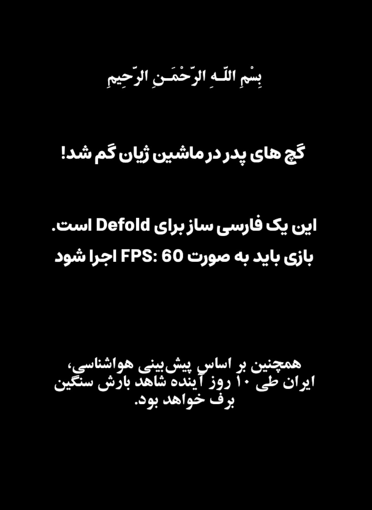

RTL Text Support for Defold (Persian / Arabic)

A lightweight RTL (Right-to-Left) text shaping and rendering helper for the Defold game engine, focused on Persian (Farsi) and Arabic text.

This library makes it possible to correctly display Persian and Arabic text in Defold GUI nodes without relying on native shaping support.

📌 Based On

This library is inspired by and based on the following repository:

🔗 https://github.com/kouba06/modifierToArab

The original project provided the core idea for Arabic character shaping.
This Defold version extends and adapts it specifically for game UI usage, fixing multiple shaping edge cases and adding proper Persian letter support.

🖼 Screenshot
<p align="center">  </p>


✨ Features

✅ Correct RTL rendering for Persian & Arabic

✅ Proper character shaping
(isolated / initial / medial / final)

✅ Supports Arabic diacritics (Tashkeel / Harakat)
(َ ِ ُ ّ ٰ ْ etc.)

✅ Supports Persian semi-space (ZWNJ / نیم‌فاصله)
(used in words like: می‌خواهم، کتاب‌ها)

✅ Supports mixed text
(numbers, punctuation, Latin + Persian)

✅ Multi-line RTL text support


📌 Example (GUI Script)
local rtl_util = require("rtl_text.rtl_util")
local rtl_text = require("rtl_text.rtl_modifier")

```
function init(self)
	local text_node1 = gui.get_node("test_text_1")
	local text_node2 = gui.get_node("test_text_2")
	local text_node3 = gui.get_node("test_text_3")
	local text_node4 = gui.get_node("test_text_4")

	local text1 = "بِسْمِ اللَّـهِ الرَّحْمَـٰنِ الرَّحِيمِ"
	local text2 = " گچ های پدر در ماشین ژیان گم شد!"

	local multi_line_text_1 = [[
	این یک فارسی ساز برای Defold است.
	بازی باید به صورت FPS: 60 اجرا شود
	]]

	local multi_line_text_2 =
	"همچنین بر اساس پیش‌بینی هواشناسی، ایران طی ۱۰ روز آینده شاهد بارش سنگین برف خواهد بود."

	gui.set_text(text_node1, rtl_text.get_rtl_text(text1))
	gui.set_text(text_node2, rtl_text.get_rtl_text(text2))

	rtl_util.modify_multi_line_text_to_text_node(text_node3, multi_line_text_1)
	rtl_util.modify_multi_line_text_to_text_node(text_node4, multi_line_text_2)
end
```


⚠️ Notes

Your font must include Arabic Presentation Forms

Common Persian fonts like B Zar and Estedad work well